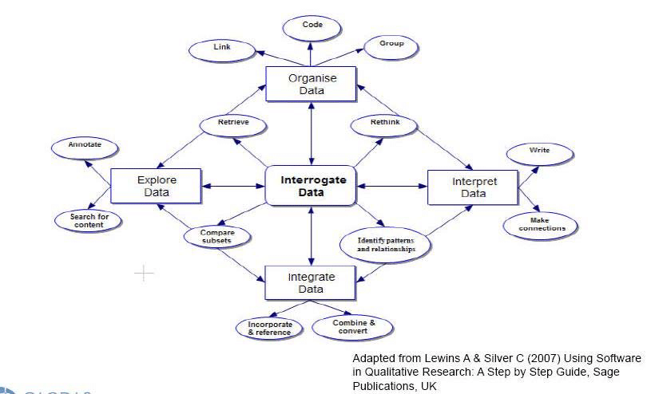

layout: true

```{r setup, include=FALSE}
options(htmltools.dir.version = FALSE)

knitr::opts_chunk$set(
	echo = FALSE,
	fig.align = "center",
	message = FALSE,
	warning = FALSE,
	cache = FALSE
)
```

```{r eval=FALSE, include=FALSE}
library(knitr)
library(tidyverse)
library(widgetframe)
```

---
class: middle, center  

```{r, out.width="40%"}
knitr::include_graphics("img/logo_MA_color.png")
```

## Laboratório de Humanidades Digitais da UFBA

**Twitter**: [@labhdufba](https://twitter.com/labhdufba) 
<br>
**Instagram**: [@labhdufba](http://instagram.com/labhdufba)
<br>
**Github**: [https://github.com/LABHDUFBA](https://github.com/LABHDUFBA)
<br>
**Youtube**: [https://www.youtube.com/c/LABHDUFBA](https://www.youtube.com/c/LABHDUFBA)

---
class: inverse, center, middle

# Pontos de partida

---
class: inverse, center, middle

# Aspectos gerais das sociedades digitais contemporâneas...

---
class: middle, center

## "Digitalização do eu na vida cotidiana" 

```{r, out.width="80%"}

```
---
class: middle, center

## Algoritmização de processos sociais

```{r, out.width="60%"}
knitr::include_graphics("img/matrix-digital-self.png")
```

---
class: middle, center

## Traços digitais (digital data trace)

```{r, out.width="75%"}
knitr::include_graphics("img/socioloy.png")
```

---
class: middle, center

## Dataficação

```{r, out.width="75%"}

```

---
class: middle, center

## Cultura de vigilância


```{r, out.width="65%"}
knitr::include_graphics("img/surv.jpg")
```

---
class: inverse, center, middle

# O que eu devo fazer?

---
class: middle, center

# Precisamos deixar de ser noobs!
```{r, out.width="60%"}
knitr::include_graphics("https://media0.giphy.com/media/CjmvTCZf2U3p09Cn0h/giphy-downsized.gif")
```

---
class: inverse, center, middle

# Novas teorias...

---
class: center, middle

## "O fato contundente é que a sociologia está lamentavelmente despreparada para lidar com esse problema: não temos nem as ferramentas analíticas nem a imaginação conceitual necessária." 
<br>
### (Reflections on the Future of Sociology, Andrew Abbott, 2000, p. 298, tradução nossa)

---
class: center, middle

--
## Sociologia com preocupações esotéricas, internalistas, auto-referidas;
<br>

--
## "sociólogos profissionais.. não são as únicas pessoas que investigam, analisam, teorizam e dão voz... aos fenômenos de um ponto de vista 'social'"
<br>

--
## "outros atores às vezes produzem melhor ciência social do que... os cientistas sociais"

---
class: inverse, center, middle

# Novas metodologias...

---
class: middle, center

## Incorporando técnicas de webscraping

```{r, out.width="85%"}
knitr::include_graphics("img/webscraping.png")
```
---
class: middle, center

## Incorporando técnicas de webscraping

```{r, out.width="85%"}
knitr::include_graphics("img/webscraping2.png")
```

---
class: middle, center

## Incorporando linguagens de programação

```{r, out.width="75%"}
knitr::include_graphics("img/linguagens.jpg")
```

---
class: middle, center

## Incorporando aplicativos para análise dos dados 

```{r, out.width="100%"}

```

---
class: middle, center

## Incorporando AI e redes neurais 

```{r, out.width="100%"}
knitr::include_graphics("https://media.giphy.com/media/3o85xqzprB9DhZmVk4/giphy.gif")
```

---
class: middle, center

## Incorporando RV/RA 

```{r, out.width="100%"}
knitr::include_graphics("https://media.giphy.com/media/xUA7aXTtpFObOX7Iys/giphy.gif")
```


---
class: inverse, center, middle

# Qual o papel das Ciências Sociais em um mundo digital de dados continuamente produzidos?

```{r, out.width="80%"}
knitr::include_graphics("https://media.giphy.com/media/pOEbLRT4SwD35IELiQ/giphy.gif?cid=ecf05e475vot0dyqf7ocbyf43eh75omn2pjcymz4m65rzbf4&rid=giphy.gif&ct=g")
```
---
class: middle, center

# Nunca tivemos tantos dados, ferramentas, técnicas... 

```{r, out.width="85%"}
knitr::include_graphics("https://media.giphy.com/media/YnlDGfCxyOIYTDp86I/giphy.gif")
```

---
class: middle, center

# Apesar disso, nossos problemas NÃO acabaram! 

```{r, out.width="70%"}
knitr::include_graphics("https://media.giphy.com/media/H0kxiS2RJF2HC/giphy.gif")
```


---
class: inverse, center, middle

# Três grandes eixos de desafios:

---
class: middle, center

--
## 1. fontes digitais da pesquisa
<br>

--
## 2. métodos e técnicas digitais
<br>

--
## 3. vigilância epistemológica das pesquisas em meios digitais
<br>

---
class: middle, center
# 1. Desafios das fontes digitais

--
## publicidade/acessibilidade
<br>

--
## Evocação versus coleta (*repurpose* - Salganik, 2020)
<br>

--
## representatividade
<br>

--
## pré-construção	algorítimica
<br>

--
## capacidade computacional
<br>

---
class: middle, center
# 2. Desafios dos métodos digitais
<br>

--
## Letramento digital 
<br>

--
## pré-construção	algorítimica das ferramentas ("black-box")
<br>

--
## Articulação analógico e digital
<br>

--
## Superação da suposta oposição quali-quanti
<br>

---
class: middle, center
# 3. vigilância epistemológica das pesquisas em meios digitais
<br>

--
## Visibilidade: dados abertos, códigos abertos, ferramentas abertas;
<br>

--
## Resistir ao fascínio da objetividade e ao poder da evidência visual (Bernhard Rieder and Theo Röhle, 2012);
<br>

--
## Desconstruir fetichismos: dos dados, dos métodos e dos resultados

---
class: middle, center

--
# Vamos aprender a andar de bicicleta?
<br>

--
### Utilidade;
<br>

--
### Aprendizado; 
<br>

--
### Aperfeiçoamento;
<br>

--
### Diversificação;
<br>

--
### "Artesanato digital"
<br>

---
class: middle, center

### Referências bibliográficas

> ABBOTT, A. Reflections on the Future of Sociology. Contemporary Sociology,
New York, v. 29, n. 2, p. 296, 2000

> [BURROWS, R.; SAVAGE, M. After the Crisis? Big Data and the Methodological Challenges of Empirical Sociology. Big Data & Society, v. 1, n. 1, p. 2053951714540280, 1 abr. 2014.](https://journals.sagepub.com/doi/10.1177/2053951714540280)

> [HOWISON, J.; WIGGINS, A.; CROWSTON, K. Validity Issues in the Use of Social Network Analysis with Digital Trace Data. Journal of the Association for Information Systems, v. 12, n. 12, 29 dez. 2011.](http://aisel.aisnet.org/jais/vol12/iss12/2)

> LYON, David. Cultura da vigilância: envolvimento, exposição e ética na modernidade digital. Em:
Bruno, Fernanda et al. (orgs) Tecnopolítica da vigilância: perspectivas da margem. São Paulo:
Boitempo, p.151-179, 2018.

> MAYER-SCHÖNBERGER, V.; CUKIER, K. Big Data: A Revolution that Will Transform how We Live, Work, and Think. London: John Murray Publishers, 2013. 

---
class: middle, center

### Referências bibliográficas

> [NASCIMENTO, L. F. Sociologia digital: uma breve introdução. Salvador: EDUFBA, 2020](https://repositorio.ufba.br/ri/handle/ri/32746) 

> RIEDER & RÖHLE. “Digital methods: Five challenges.” Understanding digital humanities. In: BERRY, David-Understanding Digital HumanitiesPalgrave Macmillan UK, 2012. (Cápitulo 4, pp. 67-84.

> SALGANIK, M. J. Bit by Bit: Social Research in the Digital Age. [s.l.] Princeton University Press, 2019. 


> [SAVAGE, M.; BURROWS, R. The Coming Crisis of Empirical Sociology. Sociology, v. 41, n. 5, p. 885–899, 1 out. 2007.](https://journals.sagepub.com/doi/10.1177/0038038507080443) 

---
class: middle, center

# Obrigado!
<br>
<br>

.pull-left[
### Agradecimentos especiais:
<br>
### Profs. Fabio Gouveia e Daiane Rossi pelo convite!
<br>
]
.pull-right[
### Contatos:

[leofn3@gmail.com](mailto:leofn3@gmail.com)

[Twitter: @leofn3](https://twitter.com/leofn3)

]
